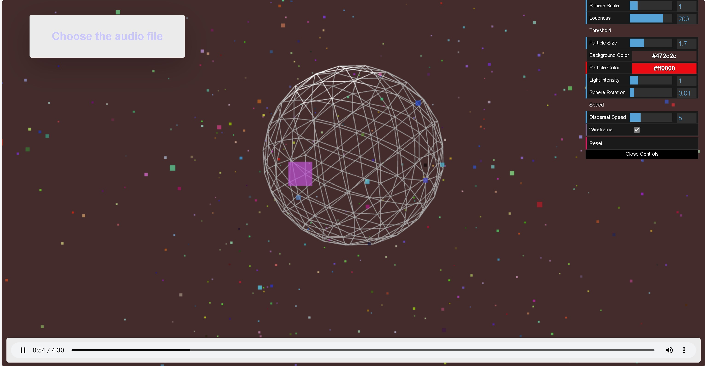

# Visualizer
A webpage that visualizes music. It is made using Three JS, WebAudioAPI, and SimplexNoise. We can seek the audio at any time; the shape changes while music is played and returns to normal when it is paused or stopped. The file accepts all audio files.
The moving objects are based on the combination of particles, sphere, and cubes from Three.js

# Installation
Clone the repository with
```bash
git clone https://github.com/rampalliprakhar/Visualizer
```
Install Live Server from the VS Code Extensions

# Navigate the directory
```bash
cd Visualizer
```
# Run it 
Press the "Go Live" button at the bottom right of the VS Code window to see the application.


