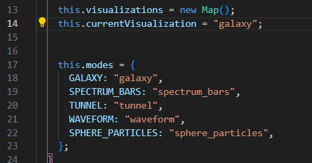

# Advanced Audio Visualizer

- A modular, responsive audio visualizer built with Three.js, Web Audio API, and modern JavaScript modules. 
- Features multiple visualization modes, real-time audio analysis, and customizable themes.

## Features

- **Multiple Visualization Modes**: Sphere Particles, Spectrum Bars, Waveform, Galaxy, Tunnel
- **Real-time Audio Analysis**: Frequency bands, beat detection, audio-reactive animations
- **Modular Architecture**: Clean, maintainable code structure
- **Theme System**: Multiple color themes (Neon, Fire, Ocean, Sunset, Rainbow)
- **Performance Optimized**: Efficient rendering and audio processing

## Live Demo

[https://visualizer-psi.vercel.app/](https://visualizer-psi.vercel.app/)

## Installation

### Using Vite

```bash
# Clone the repository
git clone https://github.com/rampalliprakhar/Visualizer.git
cd Visualizer

# Install dependencies
npm install

# Start development server
npm run dev
```

## Project Structure

```
src/
├── main.js                      # Main entry point
├── style.css                    # Styles and themes
├── assets/                      # Images
├── modules/
│   ├── AudioManager.js          # Audio processing and analysis
│   ├── SceneManager.js          # Three.js scene management
│   ├── VisualizationManager.js  # Visualization coordination
│   ├── UIManager.js             # User interface and controls
│   ├── ThemeManager.js          # Theme system
│   ├── EffectsManager.js        # Visual effects
│   └── visualizations/
│       ├── BaseVisualization.js # Base class for visualizations
│       ├── SphereParticles.js   # Particle sphere visualization
│       ├── SpectrumBars.js      # Frequency spectrum bars
│       ├── Waveform.js          # Audio waveform display
│       ├── Galaxy.js            # Spiral galaxy visualization
│       └── Tunnel.js            # Tunnel effect visualization
```

## Usage

1. **Load Audio**: Click "Choose the audio file" to select an audio file
2. **Control Playback**: Use the audio controls at the bottom
3. **Switch Modes**: Change visualization modes from the GUI

## Visualization Modes

### Sphere Particles
- Audio-reactive particle system surrounding a central sphere
- Particles disperse on loud sounds and return during quiet moments
- Dynamic colors based on frequency analysis

### Spectrum Bars
- Traditional frequency spectrum display with 3D bars
- Each bar represents different frequency ranges
- Height and color respond to audio intensity

### Waveform
- Real-time audio waveform visualization
- Smooth line animation following audio patterns
- Rotating display with color transitions

### Galaxy
- Spiral galaxy with thousands of stars
- Stars pulse and move based on audio input
- Realistic spiral arm distribution

### Tunnel
- Moving tunnel effect with particle rings
- Forward motion speed responds to bass
- Ring distortion based on frequency data

## Themes

- **Default**: Clean white background with red particles
- **Neon**: Dark background with cyan highlights
- **Fire**: Dark red theme with orange/red colors
- **Ocean**: Deep blue theme with aqua colors
- **Sunset**: Warm orange/yellow gradient theme
- **Rainbow**: Black background with multicolor effects

## Audio Features

### Frequency Analysis
- Real-time FFT analysis
- Separate bass, mid, and treble frequency bands
- Visual frequency band indicators

### Beat Detection
- Automatic beat detection algorithm
- Visual beat indicator
- Beat-responsive effects

### Audio Controls
- Standard HTML5 audio controls
- File format support: MP3, WAV, OGG, M4A
- Seek, pause, volume control

## Performance Optimization

- Efficient particle systems using BufferGeometry
- Adaptive quality based on device capabilities
- Optimized for both desktop and mobile devices
- Memory management for long-running sessions

### Adding New Themes

1. Add theme configuration to `ThemeManager`
2. Add corresponding CSS classes
3. Update theme selector in UI

## Changing Visualization
1. In VisualizationManager.js, change line 14 to any mode: ["galaxy" | "spectrum_bars" | "tunnel" | "waveform" | "sphere_particles"]




## Screenshots

- Main Screen

- Visualize Screen
1. Galaxy Screen

2. Spectrum Bars Screen

3. Tunnel Screen

4. Waveform Screen

5. Sphere Particles Screen
